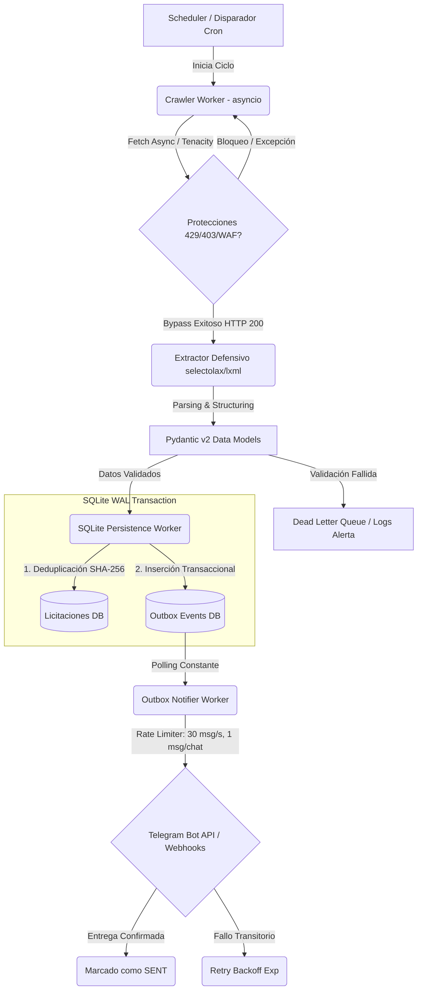
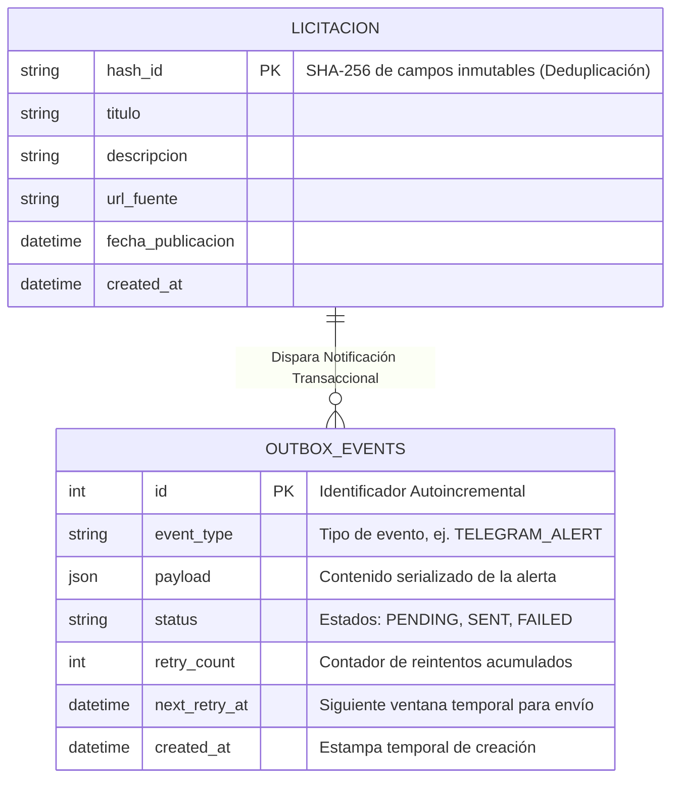

# IMPLEMENTATION_PLAN.md (Rev. 2)
# Proyecto: Radar Social - Arquitectura Staff Engineer

Este documento establece la arquitectura definitiva y los lineamientos de implementación técnica para el proyecto **radar-social**, aplicando el **Multi-Lens Framework (6 Lentes)** y la **Matriz de Casos Límite**. Su objetivo es garantizar resiliencia, alta disponibilidad, consistencia de datos y evasión de bloqueos en operaciones de web scraping y notificación.

## 1. Concurrencia y Resiliencia Asíncrona (Lente 1)

Para manejar cargas concurrentes sin saturar los recursos locales ni los servidores objetivo:

*   **Semáforos Asíncronos (`asyncio.Semaphore`):** Limitación estricta de conexiones simultáneas por dominio para evitar penalizaciones y bloqueos (ej. max 5 concurrentes por host).
*   **Colas de Tareas Desacopladas:** Uso de `asyncio.Queue` sin acotar o dinámicas para separar la ingesta (crawling) del procesamiento y la persistencia (ETL).
*   **Rotación de Clientes y Proxies:** Gestión dinámica de sesiones HTTP (`aiohttp.ClientSession` / `httpx.AsyncClient`) con rotación de User-Agents y recambio activo.
*   **Evasión de Códigos 429/403:** Implementación de retiros (backoff) exponenciales con jitter direccional usando la librería `tenacity`.
    *   `@retry(wait=wait_exponential(multiplier=1, min=4, max=10) + wait_random(0, 2), stop=stop_after_attempt(5))`

## 2. Integridad de Datos y Esquemas (Lente 2)

*   **Validación Estricta:** Uso intensivo de `Pydantic v2` para validación de datos en el límite de la aplicación (anti-corruption layer). Conversión y coerción de tipos rígida y sanitizada.
*   **Base de Datos Resiliente (SQLite):** Configuración avanzada para alta concurrencia.
    *   `PRAGMA journal_mode=WAL;` (Write-Ahead Logging para permitir lecturas y escrituras simultáneas).
    *   `PRAGMA synchronous=NORMAL;`
    *   `PRAGMA busy_timeout=5000;` (Prevención de errores "database is locked" bajo colisiones).
*   **Deduplicación Criptográfica:** Cálculo de hash `SHA-256` sobre el contenido de la licitación (título, descripción, fecha de publicación) para garantizar idempotencia en la inserción y evitar colisiones falsas.

## 3. Evasión Anti-Scraping y Parsers Defensivos (Lente 3)

*   **Detección de Falsos Positivos HTTP 200:** Lógica para detectar páginas de captura (Cloudflare, reCAPTCHA, Datadome, páginas de error soft) que devuelven código HTTP 200 pero no contienen el payload esperado.
*   **Análisis Sintáctico Robusto:** Uso de `selectolax` o `lxml` por su altísimo rendimiento computacional y tolerancia a HTML malformado.
*   **Resiliencia ante Mutaciones del DOM:** Estrategias de extracción basadas en proximidad estructural y atributos de datos invariables, evadiendo la dependencia de selectores CSS frágiles.

## 4. Despachador de Alertas Store-and-Forward (Lente 4)

Patrón transaccional para garantizar la entrega de notificaciones a sistemas externos (Telegram Bot API, Webhooks).

*   **Patrón Outbox (`outbox_events`):** Las alertas no se envían sincrónicamente durante el procesamiento. En su lugar, se insertan en la tabla transaccional `outbox_events` en la misma operación atómica de base de datos que persiste la licitación (Garantía At-Least-Once).
*   **Worker Despachador:** Un proceso autónomo en segundo plano que consume de `outbox_events` y orquesta el envío.
*   **Rate Limiting Estricto:** Control de flujo riguroso para no exceder las cuotas de las API externas:
    *   Máximo 30 mensajes por segundo (Globales).
    *   Máximo 1 mensaje por segundo por chat/usuario de Telegram.

## 5. Gestión de Memoria y Ciclo de Vida (Lente 5)

*   **Prevención de Memory Leaks:** Limpieza proactiva y explícita en loops de `asyncio` de larga duración, cerrando conexiones HTTP latentes y liberando descriptores de archivos de la base de datos.
*   **Drenaje Limpio (Graceful Shutdown):** Intercepción sistémica de señales del SO (`SIGTERM`, `SIGINT`).
    *   Detención de la ingesta de nuevas promesas.
    *   Espera controlada (timeout acotado) para que las colas asíncronas drenen los elementos en vuelo.
    *   Cierre íntegro y sin corrupción de la conexión WAL a SQLite.

---

## 6. Arquitectura y Modelado

### Diagrama ETL Pipeline (Mermaid)

### Esquema Relacional Estricto

## 7. Criterios de Aceptación y Pre-Flight Quality Gates

1. **Pre-commit y Tests (Quality Gate Infranqueable):** Ejecución mandataria de `python -m pytest tests/ -v`. Si ocurre un solo fallo, detener cualquier operación de versionado.
2. **Linting de Alta Exigencia:** Validación estricta con `python -m flake8 src/ tests/` apuntando a cero errores críticos de sintaxis.
3. **Semantic Versioning & Conventional Commits:** Los commits serán 100% en español técnico usando la estructura validada `<tipo>(<scope>): <descripción>` con tipos estandarizados (feat, fix, docs, refactor, test, ci, chore).
4. **Atomicidad:** Verificación de aislamiento en Git, sin incluir trazas, logs, bases de datos (.db, .sqlite, -wal, -shm) ni credenciales en el scope.

---
*Firma: Principal Staff Systems Architect & Frontier AI Auditor*
